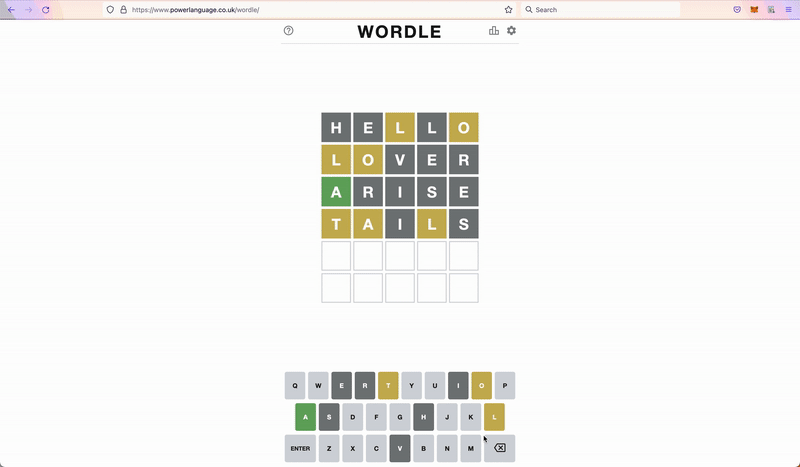

# WordlHelper

Solving Wordle has never been easier!

## Install

#### Firefox

Visit [WordlHelper](https://addons.mozilla.org/en-US/firefox/addon/wordlhelper/) and download the extension.

## Usage

Now all you have to do is go to [Wordle](https://www.powerlanguage.co.uk/wordle/), click on the extension popup window and reap the benefits!

### Examples

In this example, we know what the first letter is (A) and we know several letters that aren't in the correct positions (L, O and T).
We use the wildcards to filter for words that start with A, have either an L or T in the second place, any letter in the third place, an unused letter in the fourth place, and finally either an L or T in the last place.
This yields a list of 7 words, including ALOFT, which is the correct answer.

